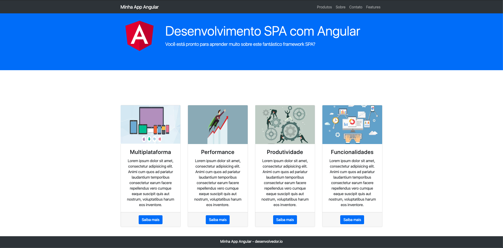
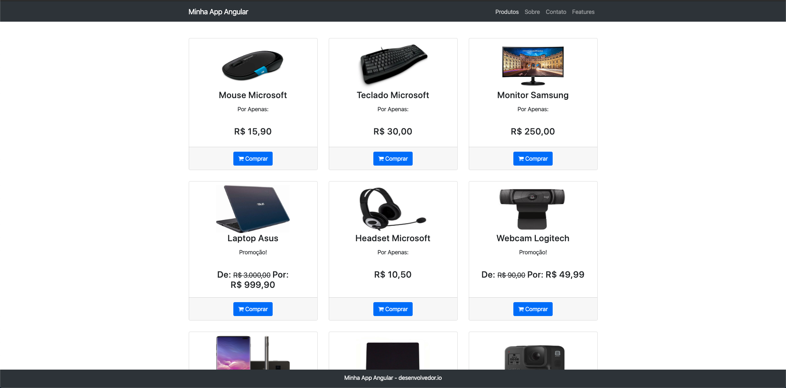

# Minha App Angular SPA
> Resumo curto sobre o produto.

[![NPM Version][npm-image]][npm-url]
[![Build Status][travis-image]][travis-url]
[![Downloads Stats][npm-downloads]][npm-url]






## Instalação do Nodejs
OS X :

Instale o Homebrew, abra o terminal e digite:
```sh
/usr/bin/ruby -e "$(curl -fsSL https://raw.githubusercontent.com/Homebrew/install/master/install)"
```
```sh
brew update
```
```sh
brew install node
```

Linux Ubuntu :

abra o terminal e digite:
```sh
sudo apt-get update
```
```sh
sudo apt-get install nodejs
```
```sh
sudo apt-get install npm
```

Windows:

Instale o chocolatey, abra o powershell como Administrador digite:

```sh
Set-ExecutionPolicy Bypass -Scope Process -Force; iex ((New-Object System.Net.WebClient).DownloadString('https://chocolatey.org/install.ps1'))
```
```sh
choco install nodejs
```


## Instalação do Angular CLI

```sh
npm install -g @angular/cli
```

## Instalação do JSON Server
```sh
npm install -g json-server
```


## Executando o JSON Server
dentro da pasta src onde está o arquivo produtos.json  execute os comandos

```sh
json-server --watch produtos.json
```

## Executando o projeto
```sh
ng s
```
